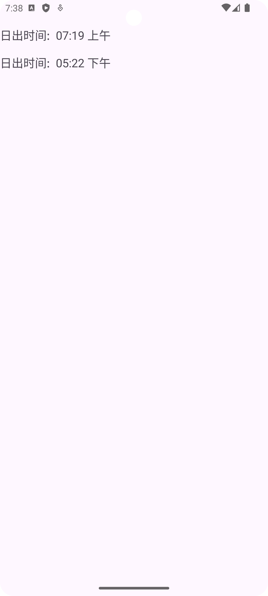

# Specifications

Runs on SDK 33+
Compile target is SDK 34
Java v1.8+
Coding runs only SDK 26+ (localization is supported)

# Coding 

```kotlin
// to get localized time with Chinese locale
private fun getLocalizedTime(time: LocalDateTime, context: Context): String {
    val userPreferredLanguage = Locale.SIMPLIFIED_CHINESE.language
    val sdf = SimpleDateFormat("hh:mm a", Locale(userPreferredLanguage))
    return sdf.format( time.atZone(ZoneId.systemDefault()).toInstant().toEpochMilli())
}

// to get localized label with Chinese locale
private fun Context.getString(locale: Locale, @StringRes resId: Int, vararg formatArgs: Any): String {
    var conf: Configuration = resources.configuration
    conf = Configuration(conf)
    conf.setLocale(locale)
    val localizedContext = createConfigurationContext(conf)
    return localizedContext.resources.getString(resId, *formatArgs)
}

getString(Locale.SIMPLIFIED_CHINESE, R.string.SunriseTime)
```

# Screenshot

